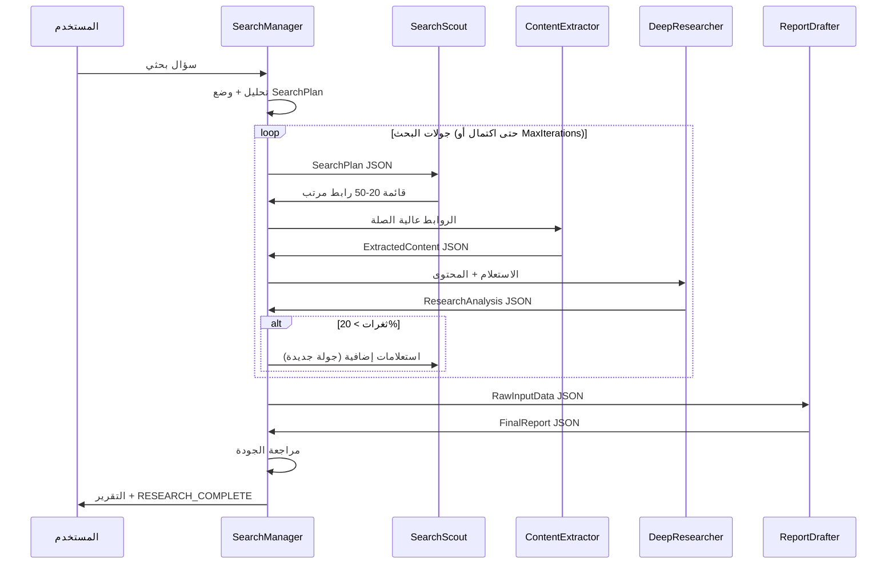

# CLAUDE.md

This file provides guidance to Claude Code (claude.ai/code) when working with code in this repository.

---

## نظرة عامة

نظام بحث عميق متعدد الوكلاء (Multi-Agent Deep Research System) — خمسة وكلاء متخصصة تعمل كسلسلة: البحث ← الاستخراج ← التحليل ← الصياغة، بإشراف Orchestrator مركزي.

- **Python + AutoGen** → `search-manager-agent/` (Orchestrator / SelectorGroupChat)
- **TypeScript + deepagents** → الوكلاء الأربعة الأخرى (Workers)

للتوثيق الكامل راجع [AGENTS.md](AGENTS.md).

---

## 1. نظرة عامة على المشروع

**الاسم**: نظام البحث العميق متعدد الوكلاء (Multi-Agent Deep Research System)

**الهدف**: تنفيذ أبحاث شاملة وتلقائية عبر تنسيق خمسة وكلاء متخصصين يعملون معاً لاستقبال سؤال بحثي، البحث في الويب، استخراج المحتوى، التحليل العميق، وصياغة تقرير احترافي نهائي.

**النمط المعماري**: Orchestrator/Worker Pattern باستخدام SelectorGroupChat

**اللغات والأطر**:
- Python + AutoGen → وكيل الإدارة (Orchestrator)
- TypeScript + deepagents → وكلاء العمال (Workers)

---

## أوامر التشغيل

### TypeScript Workers (الأربعة)

```bash
cd <agent-folder> && npm install

npm run dev      # تشغيل مع مراقبة التغييرات (tsx watch)
npm run build    # بناء TypeScript → dist/
npm start        # تشغيل النسخة المبنية
```

> **استثناء** — `content-extractor-agent` يستخدم `ts-node` (CommonJS) لذا `npm start` يساوي `ts-node src/index.ts`

`deep-research-analysis-agent` — واجهة CLI مختلفة:
```bash
npm run dev -- --query "سؤالك" --depth deep --max-sources 8 --min-credibility 65
npm run typecheck   # فحص الأنواع فقط (هذا الوكيل وحده يحتوي على هذا الأمر)
```

### Python Orchestrator

```bash
cd search-manager-agent
pip install -r requirements.txt
copy ..\\.env.example ..\\.env   # ثم أضف OPENAI_API_KEY

python -m src.main --query "سؤالك هنا"
python -m src.main --query "سؤالك" --model gpt-4o
python -m src.main --readiness
```

### العقد الموحد بين الوكلاء (Envelope V1)

- الإصدار: `research-task-envelope/v1`
- المسار المشترك: `shared/types` + `shared/validators`
- الوكلاء الأربعة تدعم الإدخال عبر:
  - stdin (JSON envelope)
  - `--envelope-path=<path>`
- المخرجات الموحدة في جميع الوكلاء:
  - `metadata`
  - `results`

### تشغيل النظام كاملاً

شغّل كل وكيل TypeScript أولاً (نوافذ منفصلة)، ثم شغّل Orchestrator:
```bash
# نافذة 1-4: كل وكيل TypeScript في مجلده
npm start

# نافذة 5 (بعد الأربعة):
cd search-manager-agent && python -m src.main --query "..."
```

---

## اختلافات Module System بين الوكلاء

| الوكيل | Module | Runner | LLM الافتراضي |
|--------|:------:|:------:|:-------------:|
| search-scout | ESM (type:module) | tsx | Anthropic/OpenAI |
| content-extractor | CommonJS | ts-node | OpenAI gpt-4o |
| deep-research | ESM + NodeNext | tsx | OpenAI |
| report-drafting | ESM + Node16 | tsx | Claude Sonnet |

**تحذير**: لا تخلط `import`/`require` — كل وكيل له نظام modules مختلف.

---

## 2. هيكل المجلدات

```
New folder (5)/
├── AGENTS.md                          # هذا الملف
├── search-manager-agent/              # Python + AutoGen (Orchestrator)
│   ├── src/
│   │   ├── main.py                    # نقطة الدخول الرئيسية
│   │   ├── config.py                  # إعدادات النظام ومتغيرات البيئة
│   │   ├── tools/
│   │   │   ├── search_scout_tool.py   # أداة استدعاء SearchScout
│   │   │   ├── content_extractor_tool.py  # أداة استدعاء ContentExtractor
│   │   │   ├── deep_research_tool.py  # أداة استدعاء DeepResearcher
│   │   │   └── report_drafting_tool.py    # أداة استدعاء ReportDrafter
│   │   └── agents/
│   │       └── manager_agent.py       # تعريف وكيل المدير
│   └── requirements.txt
├── search-scout-agent/                # TypeScript + deepagents
│   ├── src/
│   │   └── index.ts
│   ├── package.json
│   └── tsconfig.json
├── content-extractor-agent/           # TypeScript + deepagents
│   ├── src/
│   │   └── index.ts
│   ├── package.json
│   └── tsconfig.json
├── deep-research-analysis-agent/      # TypeScript + deepagents
│   ├── src/
│   │   └── index.ts
│   ├── package.json
│   └── tsconfig.json
├── report-drafting-agent/             # TypeScript + deepagents
│   ├── src/
│   │   └── index.ts
│   ├── package.json
│   └── tsconfig.json
├── النمط المفصل                               # قالب بحث مفصل (Detailed Research Template)
├── النمط المتوسط                               # قالب بحث متوسط (Standard Research Template)
└── النمط المختصر                               # قالب بحث مختصر (Brief Research Template)
```

---

## 3. الوكلاء - وصف تفصيلي

### الوكيل 1: SearchManager
**المسار**: `search-manager-agent/`
**اللغة/الإطار**: Python / AutoGen (autogen-agentchat)
**الدور**: Orchestrator (المنسق الرئيسي)
**النمط**: SelectorGroupChat

#### المهام:
- استقبال الطلبات البحثية من المستخدم
- تحليل السؤال البحثي وتقسيمه إلى 3-5 مهام فرعية
- وضع خطة بحث منظمة (SearchPlan)
- توزيع المهام على الوكلاء المتخصصين
- تتبع التقدم وإدارة الجولات البحثية المتعددة
- مراجعة جودة النتائج قبل التسليم النهائي
- الإعلان عن اكتمال البحث بكتابة: `RESEARCH_COMPLETE`

#### شرط الإنهاء (Termination):
```python
TextMentionTermination("RESEARCH_COMPLETE") | MaxMessageTermination(50)
```

#### المدخلات:
- سؤال بحثي من المستخدم (نص حر)

#### المخرجات:
- تقرير بحثي نهائي منسق
- يكتب `RESEARCH_COMPLETE` عند الانتهاء

---

### الوكيل 2: SearchScout
**المسار**: `search-scout-agent/`
**اللغة/الإطار**: TypeScript / deepagents
**الدور**: Worker - باحث الويب

#### المهام:
- توليد استعلامات بحثية ذكية ومتنوعة بناءً على SearchPlan
- البحث المتوازي على محركات بحث متعددة
- تقييم صلة الروابط بالموضوع (relevance scoring)
- إزالة التكرارات وترتيب النتائج

#### المدخلات (Input Schema):
```typescript
interface SearchPlan {
  query: string;           // الاستعلام الرئيسي
  subQueries: string[];    // الاستعلامات الفرعية
  language: string;        // لغة البحث المفضلة
  maxResults: number;      // الحد الأقصى للنتائج (افتراضي: 50)
  dateRange?: {
    from: string;          // تاريخ البداية (ISO 8601)
    to: string;            // تاريخ النهاية (ISO 8601)
  };
}
```

#### المخرجات (Output Schema):
```typescript
interface SearchResult {
  url: string;
  title: string;
  snippet: string;
  relevanceScore: number;  // 0.0 - 1.0
  source: string;          // اسم محرك البحث
  fetchedAt: string;       // ISO 8601 timestamp
}

type SearchOutput = SearchResult[]; // قائمة 20-50 رابط مرتب تنازلياً
```

---

### الوكيل 3: ContentExtractor
**المسار**: `content-extractor-agent/`
**اللغة/الإطار**: TypeScript / deepagents
**الدور**: Worker - مستخرج المحتوى

#### المهام:
- جلب محتوى صفحات الويب من الروابط المقدمة
- تنظيف HTML واستخراج النص الخام
- استخراج البيانات الوصفية (metadata)
- التعامل مع أخطاء الشبكة وإعادة المحاولة تلقائياً

#### المدخلات (Input Schema):
```typescript
interface ExtractionRequest {
  urls: string[];          // قائمة الروابط للاستخراج
  maxConcurrent: number;   // طلبات متزامنة (افتراضي: 5)
  timeout: number;         // مهلة الطلب بالمللي ثانية (افتراضي: 10000)
}
```

#### المخرجات (Output Schema):
```typescript
interface ExtractedContent {
  url: string;
  title: string;
  body: string;            // النص المنظف
  metadata: {
    author?: string;
    publishDate?: string;
    description?: string;
    language?: string;
    wordCount: number;
  };
  status: "success" | "failed" | "timeout";
  error?: string;
}

type ExtractionOutput = ExtractedContent[];
```

---

### الوكيل 4: DeepResearcher
**المسار**: `deep-research-analysis-agent/`
**اللغة/الإطار**: TypeScript / deepagents
**الدور**: Worker - المحلل العميق

#### المهام:
- تحليل وتركيب المحتوى المستخرج من مصادر متعددة
- التحقق من مصداقية المعلومات وتعارضها
- تصنيف الحقائق (مؤكدة / مرجّحة / متناقضة)
- اكتشاف الثغرات المعرفية في البحث الحالي
- **قرار مهم**: إذا كانت نسبة الثغرات > 20% → طلب جولة بحث جديدة

#### المدخلات (Input Schema):
```typescript
interface ResearchInput {
  originalQuery: string;        // السؤال البحثي الأصلي
  extractedContents: ExtractedContent[];  // المحتوى المستخرج
  previousFindings?: string;    // نتائج جولات سابقة (اختياري)
  iterationNumber: number;      // رقم جولة البحث الحالية
}
```

#### المخرجات (Output Schema):
```typescript
interface ResearchAnalysis {
  confirmedFacts: Fact[];       // حقائق موثقة بمصادر متعددة
  probableFacts: Fact[];        // حقائق بمصدر واحد أو غير موثوق تماماً
  contradictions: Contradiction[];  // تعارضات بين المصادر
  knowledgeGaps: string[];      // ثغرات معرفية مكتشفة
  gapPercentage: number;        // نسبة الثغرات (0-100)
  recommendNewSearch: boolean;  // true إذا gapPercentage > 20
  newSearchQueries?: string[];  // استعلامات إضافية مقترحة
  summary: string;              // ملخص التحليل
}

interface Fact {
  content: string;
  sources: string[];            // قائمة URLs المصادر
  confidence: number;           // 0.0 - 1.0
}

interface Contradiction {
  topic: string;
  position1: { content: string; source: string };
  position2: { content: string; source: string };
}
```

---

### الوكيل 5: ReportDrafter
**المسار**: `report-drafting-agent/`
**اللغة/الإطار**: TypeScript / deepagents
**الدور**: Worker - كاتب التقارير

#### المهام:
- تجميع جميع نتائج البحث والتحليل
- صياغة تقرير احترافي ومنظم
- اختيار قالب التقرير المناسب (أنماط التقارير الثلاثة)
- توليد قائمة مراجع منسقة

#### المدخلات (Input Schema):
```typescript
interface RawInputData {
  query: string;                    // السؤال البحثي الأصلي
  analysis: ResearchAnalysis;       // نتائج التحليل العميق
  allSources: SearchResult[];       // جميع المصادر المستخدمة
  reportType: "detailed" | "standard" | "brief";  // نوع التقرير
  language: string;                 // لغة التقرير المطلوبة
}
```

#### المخرجات (Output Schema):
```typescript
interface FinalReport {
  title: string;
  executiveSummary: string;         // ملخص تنفيذي (200-300 كلمة)
  body: ReportSection[];            // أقسام التقرير
  conclusions: string;              // الاستنتاجات
  recommendations?: string;         // التوصيات (اختياري)
  bibliography: Citation[];         // قائمة المراجع
  metadata: {
    generatedAt: string;            // ISO 8601 timestamp
    totalSources: number;
    researchIterations: number;
    wordCount: number;
  };
}

interface ReportSection {
  heading: string;
  content: string;
  subsections?: ReportSection[];
}

interface Citation {
  index: number;
  url: string;
  title: string;
  author?: string;
  publishDate?: string;
  accessDate: string;
}
```

---

## 4. مخطط سير العمل (Workflow Diagram)

```
┌─────────────────────────────────────────────────────────────────────┐
│                         المستخدم (User)                             │
│                    "سؤال بحثي / Research Query"                     │
└─────────────────────────────┬───────────────────────────────────────┘
                              │ (1)
                              ▼
┌─────────────────────────────────────────────────────────────────────┐
│                    SearchManager (Orchestrator)                      │
│              Python + AutoGen / SelectorGroupChat                    │
│                                                                     │
│  يحلل السؤال → يضع خطة بحث → يوزع المهام → يراجع الجودة           │
└──────┬──────────────┬──────────────────────┬────────────────────────┘
       │              │                      │
       │ (2)          │                      │
       ▼              │                      │
┌──────────────┐      │                      │
│ SearchScout  │      │                      │
│  TypeScript  │      │                      │
│              │      │                      │
│ يبحث في     │      │                      │
│ محركات متعددة│      │                      │
│              │      │                      │
│ Output:      │      │                      │
│ 20-50 رابط  │      │                      │
└──────┬───────┘      │                      │
       │ (3) قائمة الروابط                  │
       └──────────────┘                      │
                       │ (4)                 │
                       ▼                     │
              ┌─────────────────┐            │
              │ ContentExtractor│            │
              │   TypeScript    │            │
              │                 │            │
              │ يجلب نصوص      │            │
              │ الصفحات        │            │
              │                 │            │
              │ Output:         │            │
              │ ExtractedContent│            │
              └────────┬────────┘            │
                       │ (5) محتوى النصوص   │
                       └─────────────────────┘
                                             │ (6)
                                             ▼
                                    ┌─────────────────┐
                                    │  DeepResearcher  │
                                    │   TypeScript     │
                                    │                  │
                                    │ يحلل ويتحقق     │
                                    │ ويكتشف الثغرات  │
                                    └────────┬─────────┘
                                             │
                              ┌──────────────┴──────────────┐
                              │                             │
                         (7a) ثغرات > 20%           (7b) مكتمل
                              │                             │
                              ▼                             ▼
                    ┌──────────────────┐         ┌──────────────────┐
                    │   جولة بحث جديدة│         │  ReportDrafter   │
                    │  (SearchScout)   │         │   TypeScript     │
                    │  ← يعود للخطوة 2│         │                  │
                    └──────────────────┘         │ يصيغ التقرير     │
                                                 │ النهائي          │
                                                 └────────┬─────────┘
                                                          │ (8)
                                                          ▼
                                               ┌──────────────────────┐
                                               │   SearchManager       │
                                               │                       │
                                               │ مراجعة نهائية +      │
                                               │ RESEARCH_COMPLETE    │
                                               └──────────┬───────────┘
                                                          │ (9)
                                                          ▼
                                               ┌──────────────────────┐
                                               │     المستخدم          │
                                               │  التقرير النهائي     │
                                               └──────────────────────┘
```

### مخطط Mermaid (بديل):



---

## 5. متغيرات البيئة المطلوبة

### search-manager-agent (.env):
```env
# مفاتيح نماذج الذكاء الاصطناعي
OPENAI_API_KEY=sk-...
ANTHROPIC_API_KEY=sk-ant-...

# إعدادات الوكلاء الفرعيين (عناوين الخدمات)
SEARCH_SCOUT_URL=http://localhost:3001
CONTENT_EXTRACTOR_URL=http://localhost:3002
DEEP_RESEARCHER_URL=http://localhost:3003
REPORT_DRAFTER_URL=http://localhost:3004

# إعدادات AutoGen
AUTOGEN_MODEL=gpt-4o
AUTOGEN_MAX_TOKENS=4096
AUTOGEN_TEMPERATURE=0.3

# إعدادات سير العمل
MAX_SEARCH_ITERATIONS=5
GAP_THRESHOLD_PERCENT=20
MAX_GROUP_MESSAGES=50
```

### search-scout-agent (.env):
```env
OPENAI_API_KEY=sk-...
ANTHROPIC_API_KEY=sk-ant-...

# محركات البحث
GOOGLE_SEARCH_API_KEY=...
GOOGLE_SEARCH_CX=...
BING_SEARCH_API_KEY=...
SERPER_API_KEY=...

PORT=3001
MAX_RESULTS_PER_QUERY=50
MAX_CONCURRENT_SEARCHES=3
```

### content-extractor-agent (.env):
```env
OPENAI_API_KEY=sk-...

PORT=3002
MAX_CONCURRENT_REQUESTS=5
REQUEST_TIMEOUT_MS=10000
MAX_RETRIES=3
```

### deep-research-analysis-agent (.env):
```env
OPENAI_API_KEY=sk-...
ANTHROPIC_API_KEY=sk-ant-...

PORT=3003
ANALYSIS_MODEL=claude-3-5-sonnet-20241022
GAP_DETECTION_THRESHOLD=0.20
```

### report-drafting-agent (.env):
```env
OPENAI_API_KEY=sk-...
ANTHROPIC_API_KEY=sk-ant-...

PORT=3004
DRAFTING_MODEL=claude-3-5-sonnet-20241022
DEFAULT_REPORT_LANGUAGE=ar
```

---

## 6. التثبيت والتشغيل

### المتطلبات الأساسية:
- Python >= 3.11
- Node.js >= 20.0
- npm >= 10.0

---

### تثبيت search-manager-agent:

```bash
cd search-manager-agent

# إنشاء بيئة افتراضية
python -m venv venv

# تفعيل البيئة (Linux/Mac)
source venv/bin/activate

# تفعيل البيئة (Windows)
venv\Scripts\activate

# تثبيت المتطلبات
pip install -r requirements.txt

# نسخ وتعديل ملف البيئة
copy ..\\.env.example ..\\.env
# عدّل .env بمفاتيحك

# تشغيل الوكيل
python src/main.py
```

#### requirements.txt:
```
autogen-agentchat>=0.4.0
autogen-ext[openai]>=0.4.0
python-dotenv>=1.0.0
httpx>=0.27.0
pydantic>=2.0.0
```

---

### تثبيت وكلاء TypeScript (نفس الخطوات لكل منهم):

```bash
# مثال: search-scout-agent
cd search-scout-agent

# تثبيت المتطلبات
npm install

# نسخ وتعديل ملف البيئة
copy ..\\.env.example ..\\.env
# عدّل .env بمفاتيحك

# بناء المشروع
npm run build

# تشغيل الوكيل
npm start

# أو في وضع التطوير
npm run dev
```

#### package.json (مثال - search-scout-agent):
```json
{
  "dependencies": {
    "deepagents": "latest",
    "@langchain/openai": "^0.3.0",
    "@langchain/anthropic": "^0.3.0",
    "dotenv": "^16.0.0",
    "express": "^4.18.0",
    "zod": "^3.22.0"
  },
  "devDependencies": {
    "typescript": "^5.3.0",
    "@types/node": "^20.0.0",
    "ts-node": "^10.9.0"
  },
  "scripts": {
    "build": "tsc",
    "start": "node dist/index.js",
    "dev": "ts-node src/index.ts"
  }
}
```

---

### تشغيل النظام كاملاً:

```bash
# الطريقة 1: تشغيل يدوي (4 نوافذ Terminal منفصلة)
# Terminal 1:
cd search-scout-agent && npm start

# Terminal 2:
cd content-extractor-agent && npm start

# Terminal 3:
cd deep-research-analysis-agent && npm start

# Terminal 4:
cd report-drafting-agent && npm start

# Terminal 5 (الأخير - بعد تشغيل الجميع):
cd search-manager-agent && python src/main.py
```

```bash
# الطريقة 2: Docker Compose (إذا توفر docker-compose.yml)
docker-compose up --build
```

---

## 7. قواعد الوكلاء (Agent Rules)

> هذا القسم موجه مباشرة للوكلاء الذكاء الاصطناعي العاملين في هذا النظام.

### 7.1 القواعد العامة - ما يُسمح به:

- **مسموح**: قراءة الملفات داخل مجلد المشروع فقط
- **مسموح**: استدعاء الوكلاء الآخرين عبر الأدوات المحددة (tools)
- **مسموح**: تعديل ملفات الإخراج في المجلدات المخصصة (output/)
- **مسموح**: إجراء طلبات HTTP للمواقع العامة لأغراض البحث
- **مسموح**: تسجيل السجلات (logs) في الملفات المخصصة
- **مسموح**: إجراء جولات بحث متعددة عند اكتشاف ثغرات معرفية
- **مسموح**: طلب توضيح من SearchManager إذا كانت التعليمات غامضة

### 7.2 القواعد العامة - ما لا يُسمح به:

- **محظور**: تعديل ملفات الكود المصدري (src/) أثناء التشغيل
- **محظور**: الوصول إلى ملفات خارج مجلد المشروع
- **محظور**: تخزين بيانات المستخدم بشكل دائم بدون إذن صريح
- **محظور**: استدعاء وكلاء آخرين بشكل مباشر (يجب المرور عبر SearchManager)
- **محظور**: الإعلان عن `RESEARCH_COMPLETE` إلا من قِبل SearchManager حصراً
- **محظور**: تجاوز حد MaxMessageTermination(50) أو MaxIterations(5)
- **محظور**: إرسال طلبات HTTP لخدمات خارجية غير محددة في الإعدادات
- **محظور**: التعامل مع معلومات حساسة (كلمات مرور، بيانات شخصية) بدون تشفير

### 7.3 قواعد SearchManager (المنسق):

- يجب دائماً وضع خطة بحث قبل استدعاء أي وكيل
- يجب التحقق من جودة كل مخرج قبل تمريره للوكيل التالي
- يجب ألا يتجاوز عدد جولات البحث 5 جولات
- يجب كتابة `RESEARCH_COMPLETE` فقط عندما يكون التقرير مكتملاً وعالي الجودة
- في حالة فشل وكيل ما، يجب إعادة المحاولة مرة واحدة قبل إبلاغ المستخدم

### 7.4 قواعد SearchScout (الباحث):

- يجب أن تكون نسبة الروابط ذات الصلة (relevanceScore > 0.7) لا تقل عن 60%
- يجب تنويع مصادر البحث (لا تعتمد على محرك بحث واحد فقط)
- يجب استبعاد المواقع المعروفة بنشر معلومات مضللة
- الحد الأقصى للروابط: 50 رابطاً في كل جولة

### 7.5 قواعد ContentExtractor (مستخرج المحتوى):

- يجب احترام ملف robots.txt لكل موقع
- يجب التعامل مع أخطاء الشبكة بصمت وإعادة المحاولة (max 3 مرات)
- يجب تنظيف المحتوى من الإعلانات والعناصر غير ذات الصلة
- يجب الإبلاغ عن الروابط الفاشلة بوضوح في المخرجات

### 7.6 قواعد DeepResearcher (المحلل):

- يجب تصنيف كل حقيقة بدرجة ثقة (confidence score)
- لا يجوز إضافة معلومات من معرفته الداخلية دون الإشارة إليها صراحةً
- يجب الإبلاغ بدقة عن نسبة الثغرات المعرفية
- إذا كانت نسبة الثغرات > 20% يجب تقديم استعلامات بحثية محددة وليس عامة

### 7.7 قواعد ReportDrafter (كاتب التقارير):

- يجب أن يستند كل ادعاء في التقرير إلى مصدر موثق
- يجب استخدام قالب التقرير المناسب (أنماط التقارير الثلاثة)
- يجب أن تكون قائمة المراجع مرتبة ومنسقة بشكل صحيح
- يجب ذكر محدودية البحث في نهاية التقرير إذا وُجدت ثغرات معرفية

---

## 8. قوالب التقارير

### النمط المفصل - قالب بحث مفصل (Detailed):
- يُستخدم للمواضيع المعقدة التي تتطلب تغطية شاملة
- يشمل: مقدمة، خلفية تاريخية، تحليل متعمق، أقسام متعددة، استنتاجات، توصيات، مراجع
- الحد الأدنى: 3000 كلمة

### النمط المتوسط - قالب بحث متوسط (Standard):
- يُستخدم للمواضيع المتوسطة الأهمية
- يشمل: ملخص تنفيذي، النتائج الرئيسية، التحليل، الاستنتاجات، مراجع
- النطاق: 1000-3000 كلمة

### النمط المختصر - قالب بحث مختصر (Brief):
- يُستخدم للإجابات السريعة والمواضيع البسيطة
- يشمل: النقاط الرئيسية، الاستنتاج، المراجع
- الحد الأقصى: 1000 كلمة

---

## 9. أمثلة الاستخدام

### مثال 1: بحث أكاديمي

```python
# في search-manager-agent/src/main.py

from autogen_agentchat.ui import Console
from src.agents.manager_agent import create_manager_team

async def main():
    team = create_manager_team()

    query = """
    ما هو تأثير الذكاء الاصطناعي على سوق العمل في منطقة الشرق الأوسط
    خلال الفترة 2020-2025؟ أريد تقريراً مفصلاً يشمل الإحصاءات والتوقعات.
    """

    await Console(team.run_stream(task=query))

if __name__ == "__main__":
    import asyncio
    asyncio.run(main())
```

### مثال 2: بحث تقني سريع

```python
query = "ما هي أفضل مكتبات Python لمعالجة البيانات الضخمة في 2025؟"

# سيختار SearchManager قالب التقرير المختصر (النمط المختصر)
# وسيجري جولة بحث واحدة فقط
```

### مثال 3: بحث استراتيجي

```python
query = """
أجرِ دراسة شاملة عن اتجاهات الطاقة المتجددة في أفريقيا جنوب الصحراء،
مع التركيز على الطاقة الشمسية وطاقة الرياح،
والتحديات الاقتصادية والبنية التحتية،
والفرص الاستثمارية المتاحة.
"""

# سيختار SearchManager قالب التقرير المفصل (النمط المفصل)
# قد يجري 3-5 جولات بحثية
```

---

## 10. التعامل مع الأخطاء

| الخطأ | السبب المحتمل | الحل |
|-------|--------------|------|
| وكيل لا يستجيب | الخدمة متوقفة | SearchManager يعيد المحاولة مرة واحدة ثم يبلغ المستخدم |
| لا توجد نتائج بحث | مفتاح API منتهي | التحقق من متغيرات البيئة |
| تجاوز MaxMessageTermination | حلقة لا نهائية | النظام يوقف تلقائياً ويعيد ما جُمع حتى الآن |
| نسبة ثغرات عالية دائماً | موضوع نادر أو محدود المصادر | SearchManager يبلغ عن محدودية المصادر في التقرير |
| فشل ContentExtractor | موقع محجوب | يُتخطى الرابط ويُكمل بالروابط المتاحة |

---

## 11. مراقبة الأداء والسجلات

```
logs/
├── search-manager.log       # سجل المنسق الرئيسي
├── search-scout.log         # سجل عمليات البحث
├── content-extractor.log    # سجل استخراج المحتوى
├── deep-researcher.log      # سجل التحليل
└── report-drafter.log       # سجل صياغة التقارير
```

**مستويات السجل**: DEBUG | INFO | WARNING | ERROR

**معلومات تُسجَّل دائماً**:
- وقت بدء ونهاية كل مهمة
- عدد الروابط المُعالَجة
- نسبة الثغرات المعرفية في كل جولة
- عدد جولات البحث المُنفَّذة
- حالة الإنهاء (RESEARCH_COMPLETE أو timeout أو error)

---

## معمارية الـ Prompts

جميع الـ system messages مكتوبة وفق أربعة قوالب مرجعية (`النمط المفصل`–`معيار التقييم`). عند تعديل أي prompt:

- **معايير الإدراج** (`معيار التقييم`): أكاديمي محكَّم `.edu/.gov/.org`، رسمي، مؤسسي موثّق
- **معايير الاستبعاد** (`معيار التقييم`): مدونات شخصية، Reddit/Quora، محتوى تسويقي، AI Content Farms
- **التمييز الثلاثي** (`النمط المتوسط`): `[مؤكد]` / `[مرجّح]` / `[غير محسوم]` — إلزامي في كل حقيقة
- **قاعدة المصدرين** (`معيار التقييم`): الادعاءات الحاسمة تحتاج مصدرين مستقلين
- **معيار القبول** (`معيار التقييم`): Accuracy 20%، Compliance 20%، Cross-Validation 25%، Reliability 15%، Documentation 20% — لا يُسلَّم التقرير إلا بعد استيفائها

مسارات مخرجات وقت التشغيل:
- `deep-research-analysis-agent`: يكتب في `runtime/workspace/{collection,credibility,facts,gaps,reports/}`
- `search-scout-agent`: يكتب في `/queries.json`, `/raw_results.json`, `/ranked_results.json`
- `report-drafting-agent`: يكتب في `/outline.json` → `/sections/` → `/sections_cited/` → `/final_report.md`

---

## 12. ملاحظات مهمة للمطورين

1. **الترتيب مهم**: يجب تشغيل وكلاء TypeScript قبل تشغيل SearchManager
2. **منافذ الشبكة**: تأكد من أن المنافذ 3001-3004 متاحة وغير مستخدمة
3. **مفاتيح API**: لا تُدرج مفاتيح API في ملفات الكود - استخدم ملفات .env دائماً
4. **ملفات .env**: أضف `.env` إلى `.gitignore` لتجنب رفع المفاتيح السرية
5. **تحديث القوالب**: تعديل ملفات أنماط التقارير الثلاثة سيؤثر على بنية التقارير المُولَّدة
6. **الحد الأقصى للرسائل**: MaxMessageTermination(50) يشمل جميع الرسائل بين الوكلاء

---

*آخر تحديث: مارس 2026*
*إصدار المشروع: 1.0.0*
